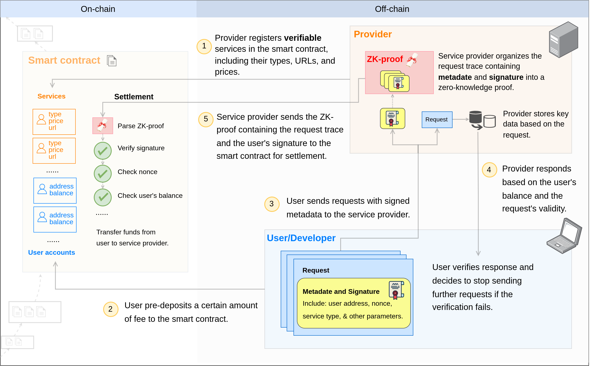

# 0G Serving Contract

## Overview

The 0G Serving Network Contract connects the [service providers](https://github.com/0gfoundation/0g-serving-broker) and [service users](https://github.com/0gfoundation/0g-serving-user-broker) in the 0G Compute Network, enabling decentralized AI services including inference and fine-tuning.

## Serving Network Architecture

The 0G Serving Network Contract is a crucial component in the overall architecture of the 0G Serving Network. Key responsibilities include:

- **Payment & Settlement**: Handle payments with smart contract escrow and automatic settlement on completion
- **Account Management**: Manage user accounts, balances, deposits, and withdrawals
- **Service Registry**: Store and manage service information (providers, URLs, pricing)
- **Verification**: Validate settlement proofs to ensure computation integrity

### Contract Architecture

The smart contract architecture consists of:

- **One LedgerManager Contract**: Manages user accounts and balances across the entire network
- **Multiple Service Contracts**: Each service (e.g., inference, fine-tuning) can have multiple versions deployed independently

### Contract Files

**Ledger**
- **LedgerManager.sol**: Central ledger that manages user accounts and balances. Handles fund deposits, withdrawals, and transfers between users and service contracts.

**Inference Service**
- **InferenceServing.sol**: Entry point for managing inference service accounts and services. Handles the fee settlement process with TEE-based verification.
- **InferenceAccount.sol**: Manages user accounts and balances for inference services.
- **InferenceService.sol**: Handles inference service information, including registration, updates, and deletions.

**Fine-Tuning Service**
- **FineTuningServing.sol**: Entry point for managing fine-tuning service accounts and services.
- **FineTuningAccount.sol**: Manages user accounts and balances for fine-tuning services.
- **FineTuningService.sol**: Handles fine-tuning service information.
- **FineTuningVerifier.sol**: Implements the core logic for verifying fine-tuning settlement proofs.

## Deployment

See [Deployment Guide](./DEPLOYMENT_GUIDE.md) for detailed instructions.
## Communities

- [0G Telegram](https://t.me/web3_0glabs)
- [0G Discord](https://discord.com/invite/0glabs)
